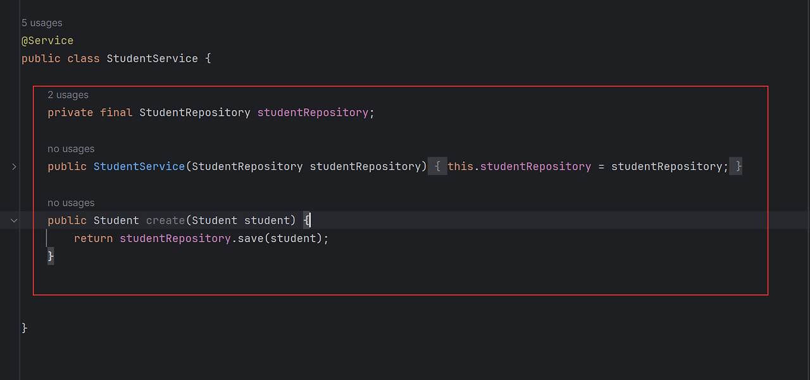
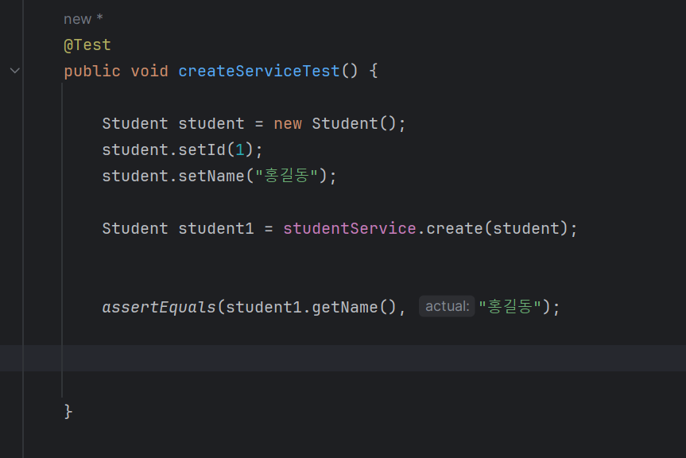
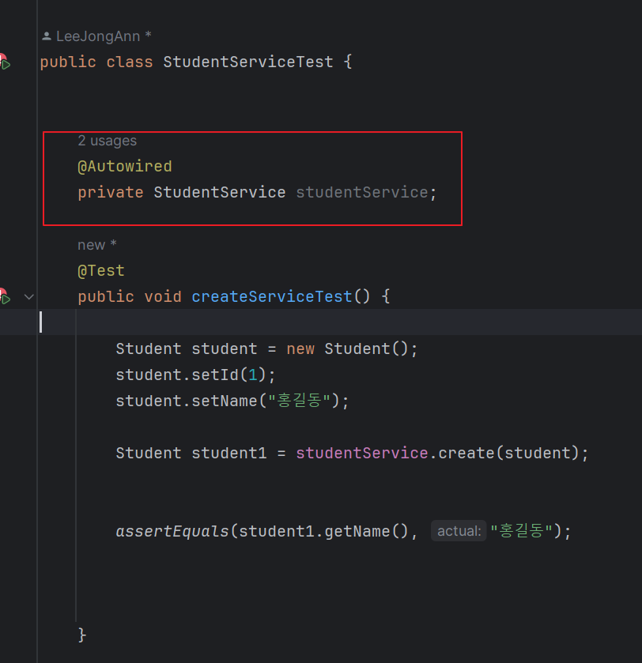
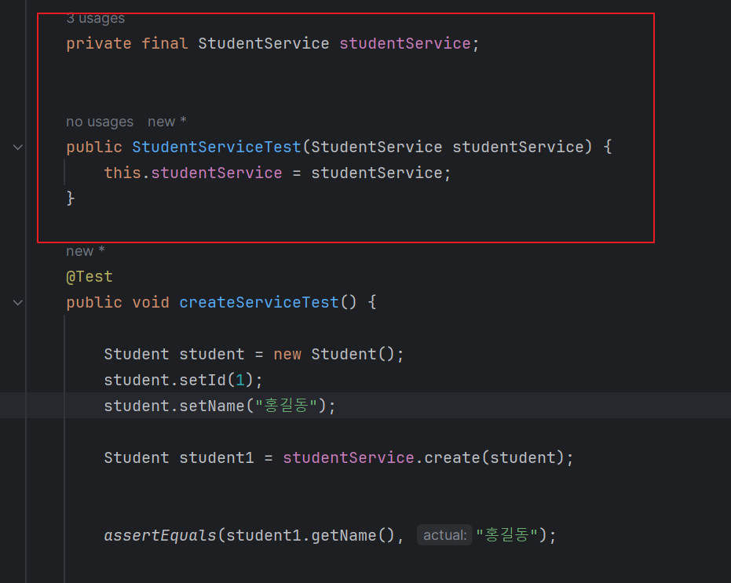
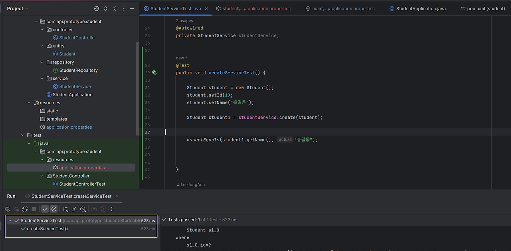
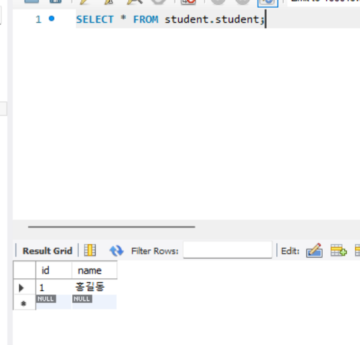

# 공부하면서 만들어가는 REST-API 프로젝트

REST-API 로 간단한 프로젝트를 만들어보려고 한다. 

 

CRUD의 기능을 넣고 postman으로 테스트를 하면서 진행할 예정이다.

 

1. 프로젝트를 세팅하고 엔티티를 작성한다. 

 

 

엔티티는 Id 와 name 두 개를 갖고 있다.

 

@lombok을 사용해서 밑에 코드를 없애줘도 되지만 그런 것 없이 진행한다. 

 

 

 

2. Controller를 작성한다. 

 

컨트롤러에 @RestController 어노테이션을 붙여준다. 

@RestController는 @Controller어노테이션에 @ResponseBody가 붙은 것으로 주로 REST 통신을 하기 위해서 사용된다.

 

@Controller는 View를 반환하는 반면  @RestController는 ResponseEntity라는 HttpStatus 코드를 추가하여 데이터를 반환한다.   

 

즉 REST-API를 작성하기 위해선 @RestController로 작성해야 된다.

 

작성한 부분을 살펴보면 파라미터로 id와 name값을 받고 있다. 

그러면 POST 요청을 날릴때 두 개의 파라미터를 던져줘야 한다. 

 

그럼 테스트 코드를 작성해보자 , 

 

 

mockMvc 객체를 사용하여 , 주소에 맞는 값을 작성하여 파라미터에 따른 값을 작성해준다. 

기대되는 Status 값은 200이다 .

 

 

테스트가 성공하였다. 

 

나머지 내용은 다시 작성하도록 하겠다. 

-------------------------------------------

1. 서비스 계층 만들기

- StudentService 클래스 생성

- create 메소드로 학생 객체 생성 및 Repository에 저장하도록 한다.

-> 생성자 주입으로 의존성을 주입시켰다.

의존성 주입에는 이렇게 3개 존재한다.

1. 필드 주입

2. 생성자 주입

3. Setter 주입

각각의 장단점이 있으며 필드 주입이 가장 간단하지만

생성자 주입을 웬만하면 권장한다.

2. 서비스 계층 테스트하기 (create 메소드) 및 전체 학생 조회하기

- create 메소드 테스트하기 (service 계층)

- get 메소드 작성하기 ( 전체 학생 조회 )

해당 코드로 테스트를 돌렸을때 아래와 같은 에러가 나온다

because "this.studentService" is null 이것은 studentService null로 나오는데

의존성 주입이 되지 않아서 발생하는 오류이다.

@Autowired로 주입했는데 오류가 뜬다

생성자 주입으로 의존성을 주입했다. 하지만 다시 오류가 발생한다.

찾아보니 Spring에서는 @Autowired가 붙어있지 않아도 자동으로 Ioc컨테이너에서 객체를

탐색해 의존성을 주입해주지만

Junit 테스트에서는 그런 환경이 조성되어 있지 않기 때문에

가상으로 Spring의 환경을 조성해줘야 한다. @SpringBootTest를 이용해준다.

테스트가 통과한 것을 알 수 있으며 DB에도 들어가 있다. 